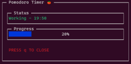
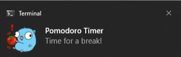

# CLI Pomodoro Timer for WSL   

This is a command-line interface (CLI) Pomodoro Timer built in Go for Windows Subsystem for Linux (WSL) which includes Windows notifications to help you stay productive. The [Linux `notify-send` utility](https://ss64.com/bash/notify-send.html) doesn't work in Windows Subsystem for Linux, so this program executes a very short powershell script to send Windows toast notifications from your WSL terminal.


## What is the Pomodoro Technique 
The Pomodoro technique is a time management method that was developed by Francesco Cirillo in the late 1980s. It uses a timer to break down work into intervals, traditionally 25 minutes in length, separated by short 5-minute breaks. The Pomodoro technique is based on the idea that frequent small breaks can improve mental agility and productivity.

You can learn more about the Pomodoro Technique [here](https://francescocirillo.com/pages/pomodoro-technique).

## Requirements

* Windows Subsystem for Linux  (WSL)
* Go 1.13 or later `sudo apt install golang-go`

## Usage

1. Open a WSL Terminal session on [Windows Terminal](https://apps.microsoft.com/store/detail/windows-terminal/9N0DX20HK701))
2. Clone this repository `git clone https://github.com/RyanBeGell/pomodoro-cli.git`
3. Navigate to the project directory in your terminal
4. If you want to customize the work and break durations, modify the workMinutes, breakMinutes, and longBreakMinutes constants in the `main.go` file.
5. Compile the application by running `go build main.go`.
6. Start the timer by running `./main`.
7. The timer will start and  by default uses traditional 25-minute cycles followed by a 5-minute break. After 4 cycles a 30-minute break begins.
8. The timer can be closed any time by pressing `q` or `Ctrl-C`.

## Features

* Uses the Pomodoro technique to manage work and break periods.
* UI with a timer display, progress bar, and status information
* Windows Desktop notifications to alert you when it's time for a break or to get back to work

## Customization
I built this tool for personal use, but you can easily adjust it to your own preferences. 

To customize the work and break durations, you can modify the workMinutes, breakMinutes, and longBreakMinutes constants in the main.go file.

```go 
const (
    workMinutes  = 25
    breakMinutes = 5
    longBreakMinutes = 30
)
```
After modifying the constants in the main.go file, you will need to recompile the program by running  `go build main.go`